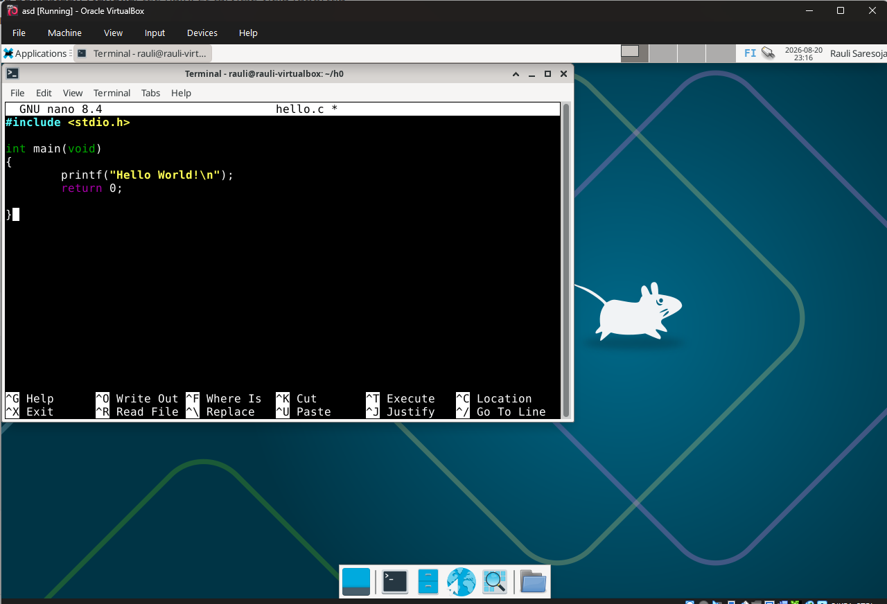
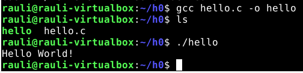
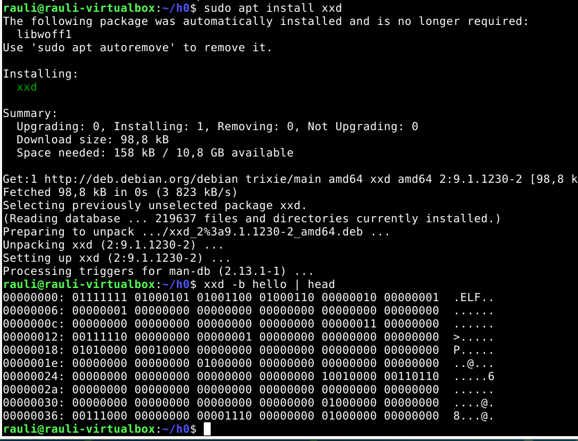

# Tehtävä h0

Tehtävä on tehty Linux Debian virtuaalikoneella kotona. Aloitusaikana 23:10.

Ensiksi tein nanolla pienen ohjelman C:llä joka printtaa "hello world" jonka tallensin nimellä hello.c

Sitten käänsin GCC (GNU Compiler Collection) -kääntäjällä lähdekoodin suoritettavaksi ohjelmaksi komennolla gcc hello.c -o hello

Viimeisenä asensin xxd jonka avulla saan näytettyä tiedoston binäärimuodossa. xdd hello näyttää tavut heksadesimaalilukuina, -b käskee xxd:tä näyttämään jokaisen tavun binäärimuodossa ja head näyttää oletuksena ensimmäiset 10 riviä ettei tule liikaa spämmiä

Tehtävän lopetusaika 23:48

# Lähteet

GeeksforGeeks. 18.8.2026. C Hello World Program. GeeksforGeeks. Luettavissa: https://www.geeksforgeeks.org/c/c-hello-world-program/. Luettu: 20.8.2026.
OpenAI. 2026. ChatGPT (GPT-5.6 Luna). ChatGPT suositteli GCC- ja xxd-työkalujen käyttöä tehtävässä.
